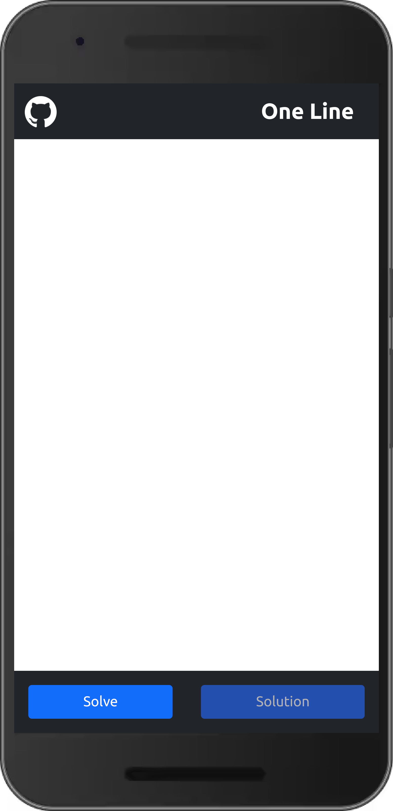

# One Line Automation

This web app is an automation for one line puzzle. <a href="https://chetan-satpute.github.io/oneline">Open</a>

One line is a puzzle where we need to connect all nodes in given pattern and every segment can be explored just once.

Formally, a pattern is a graph and objective of this puzzle is to find Euler Walk for the graph.

This web app is an automation of one line puzzle, user creates a pattern <i>(Graph)</i> on canvas and web app will find a solution <i>(Euler Walk)</i> if possible. It uses basics of graph theory and graph traversal algorithms to find solution.

 

To create a pattern:
<ol>
    <li>Click <i>(Tap)</i> two different positions on white canvas to create two nodes and a segment connecting them.</li>
    <li>Double-click <i>(Double-Tap)</i> a node to delete the node and all incident segments.</li>
</ol>

 

To solve a pattern:
<ol>
    <li>Click <strong>Start Solving</strong>
    <i>(Now pattern cannot be edited, Nodes can be draged)</i>    
    </li>
     
    <li>Three buttons are now visible  
    <ul>
         
        <li>
        <strong>Play:</strong> This button will start automation and application will attept to find a solution or tell if a solution is not possible.
        </li>
         
        <li>
        <strong>Solution:</strong> If a solution is found, one can review the solution using this button. <i>(This button will be disabled when no solution is found)</i>
        </li>
         
        <li>
        <strong>Edit:</strong> Press this button to enable editing of pattern.            
        </li>
    </ul>
    </li>
</ol>

 

