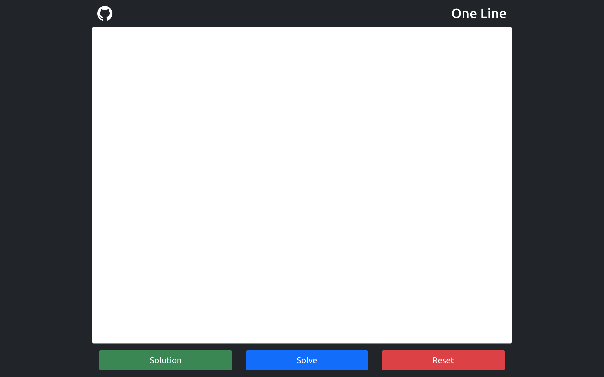

# One Line Automation

This web app is an automation for one line puzzle. <a href="https://chetan-satpute.github.io/oneline">Open</a>

Given a pattern, one needs to explore every segment of the pattern in one line <i>(Without lifting pen)</i>.

Formally, a pattern is a graph and objective of this puzzle is to find Euler Walk for the graph.

This web app solves one line puzzle, user creates a pattern <i>(Graph)</i> on canvas and web app finds a solution <i>(Euler Walk)</i>, or notify if a solution is not possible. It uses basics of graph theory and graph traversal algorithms to find solution.

 

To create a pattern:
<ol>
    <li>Click <i>(Tap)</i> two different positions on white canvas to create two nodes and a segment connecting them.</li>
    <li>Double-click <i>(Double-Tap)</i> a node to delete the node and all it's incident segments.</li>
</ol>

 

To solve a pattern:
<ol>
    <li>Click <strong>Solve</strong>.
    <i>(Now pattern cannot be edited, Nodes can be draged)</i>    
    </li>
     
    <li>
    If a solution is found click <strong>Solution</strong> to review solution.
    <i>(Solution stays until pattern is edited)</i>
    </li>
</ol>

 

